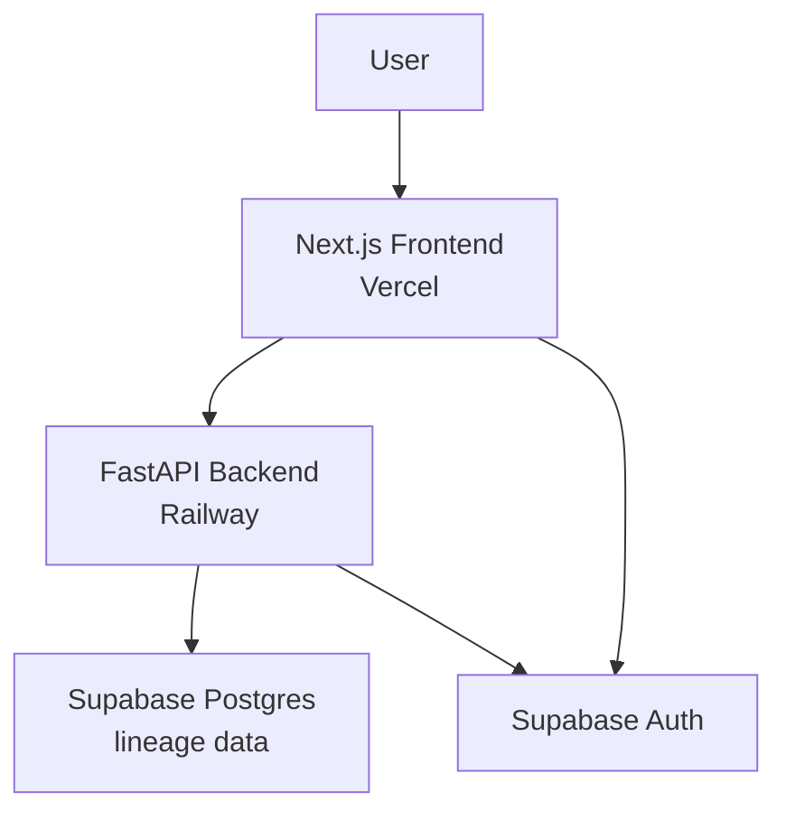

# Supabase Integration — Auth + Persistence

## Problem Frame

The app currently stores all state in-memory on the Railway backend. Every redeploy (which happens automatically on every `git push` to `master`) wipes all uploaded sources and parsed lineage data. There is no authentication — anyone with the Railway URL can access and modify all data. All users share a single global state, so multiple users interfere with each other.

The goal is to transform the app from a stateless demo tool into a proper multi-user SaaS: users log in, upload their sources, and their lineage data persists across sessions, redeployments, and server restarts.

## System Context

## Requirements

**Authentication**
- R1. Users can sign up with email and password. Email verification is required before an account can register sources or call backend APIs.
- R2. Users can log in with email and password.
- R3. All app pages require an authenticated session (Supabase default token lifetime); unauthenticated visits redirect to `/login`. Supabase handles session lifetime and token refresh automatically via `@supabase/ssr`.
- R4. Users can sign out from within the app.
- R4a. The FastAPI backend restricts CORS to the Vercel frontend origin (production and dev); the current wildcard `allow_origins=['*']` is replaced as part of this integration.
- R4b. Users can reset their password via a verified email link. Stored third-party credentials (Git PAT, Databricks token) are cleared on password reset and must be re-entered.

**Backend Auth Enforcement**
- R5. Every FastAPI endpoint validates the Supabase JWT from the `Authorization: Bearer <token>` header — checking signature (via Supabase JWKS), issuer, audience, and expiry — and extracts the `sub` claim as `user_id`. Requests without a valid JWT return 401.
- R6. The Next.js API proxy route (`app/api/backend/[...path]/route.ts`) forwards the user's Supabase access token as the `Authorization` header on every request to the Railway backend.

**Per-User Data Isolation**
- R7. Isolation is enforced at two layers: (1) every DB query in the backend includes a `WHERE user_id = {authenticated_user_id}` clause (application-layer), and (2) Row Level Security is enabled on all user-scoped tables as defense-in-depth. Two users uploading the same files produce independent, non-interfering lineage graphs.
- R8. Each user sees only the sources they have registered — no cross-user visibility in any API response.

**Credential Security**
- R9. Git PATs and Databricks tokens are encrypted at rest using application-level envelope encryption (key stored as a Railway environment variable). Tokens are never returned in any API response, never logged, and decrypted only at the point of outbound use (git clone or Databricks SDK call).

**Persistence**
- R10. Sources and their parsed lineage edges survive Railway redeployments and server restarts. All data is read from Supabase Postgres on each request; no in-memory global state is used.
- R11. All existing features (lineage graph, catalog, impact analysis, path tracing, search, warnings) work as before, operating on the persisted data. This requires refactoring all backend read endpoints — currently reading from module-level globals (`state.lineage_graph`, `state.raw_graph`, `state.source_registry`) — to query Postgres and rebuild the NetworkX graph per request.
- R12. Source refresh (re-parse) updates the stored edges for that source without requiring re-upload. For upload-type sources, the original zip bytes are stored persistently. For git and databricks sources, refresh re-pulls from the remote using persisted (encrypted) credentials.
- R13. Source deletion removes all associated lineage edges, warnings, and stored zip bytes from persistent storage.

## Success Criteria

- A user uploads sources, closes the browser, and returns the next day to find their sources intact.
- A `git push` to `master` (triggering a Railway redeploy) does not require any user to re-upload their sources.
- Two independent users cannot see or affect each other's data — enforced at both application and database layers.
- All existing features produce the same results as before.
- A direct HTTP call to the Railway backend URL without a valid Supabase JWT returns 401 on all endpoints.

## Scope Boundaries

- **No OAuth providers** — email/password only for this phase.
- **No team/org workspaces** — each account is fully independent.
- **No saved views or bookmarks.**
- **No upload history or audit log in the product UI** — auth events (signup, login, password reset) are logged internally for security incident response.
- **No global lineage view** (cross-user or cross-source merged graph) — deferred to a future phase.
- **No admin panel.**
- **No account deletion UI** — deferred; users must contact support to delete their account and data.

## Key Decisions

- **Supabase for both auth and DB:** Single integration point with official `@supabase/ssr` support for Next.js App Router. Avoids stitching together separate auth and database services.
- **Email/password auth only:** Simplest to implement; OAuth can be added later without structural changes.
- **Multi-user model (not team model):** Each account is an independent workspace.
- **Application-layer isolation + RLS:** Service-role key for all backend DB operations; every query scoped to `user_id`. RLS enabled as a defense-in-depth safety net — a missing `WHERE` clause would still be blocked at the DB level.
- **Token encryption at rest:** Application-level envelope encryption (not Vault) to avoid Supabase paid plan dependency. Encryption key stored in Railway env var.
- **Per-request graph rebuild:** Rebuild the NetworkX graph from DB edges on each request. No per-user in-memory cache. Simplest approach; profile before adding complexity.

## Dependencies / Assumptions

- A Supabase project will be created (free tier; note: 500MB DB storage limit means free tier is appropriate for low-volume testing, not production scale with many large uploads).
- Railway env vars required: `SUPABASE_URL`, `SUPABASE_SERVICE_ROLE_KEY`, `TOKEN_ENCRYPTION_KEY`.
- Vercel env vars required: `SUPABASE_URL`, `SUPABASE_ANON_KEY` (browser-safe, RLS-protected).
- The `SUPABASE_SERVICE_ROLE_KEY` must never reach the frontend bundle.
- Schema (tables, RLS policies) will be applied manually via Supabase Dashboard SQL editor before the first deploy. A Python DB client (`supabase-py` or `asyncpg`) must be added to `pyproject.toml`.
- The app currently auto-deploys to Railway on every push to `master` — this behavior continues. Schema must be applied before code is deployed.

## Outstanding Questions

### Resolve Before Planning

_None — all product decisions are resolved._

### Deferred to Planning

- **[Affects R12][Technical]** Should zip bytes be stored in a Postgres `BYTEA` column or in Supabase Storage? The 50 MB zip limit fits in Postgres but Storage is more appropriate for large blobs and avoids consuming the 500MB DB quota.
- **[Affects R10–R11][Technical]** Confirm that both `lineage_graph` and `raw_graph` are serialized to DB (path tracing at `/lineage/paths` uses `raw_graph` separately; if only one graph is stored, that endpoint silently breaks).
- **[Affects R3][Technical]** Verify `@supabase/ssr` middleware helpers work with the installed Next.js version (16.x). The project's AGENTS.md notes Next.js 16 APIs may differ significantly from prior versions.
- **[Affects R4b][Technical]** Define token clear-on-reset behavior: does the backend listen to a Supabase auth webhook, or does the frontend call a logout+clear endpoint on password change?

## Next Steps

-> `/ce:plan` for structured implementation planning
